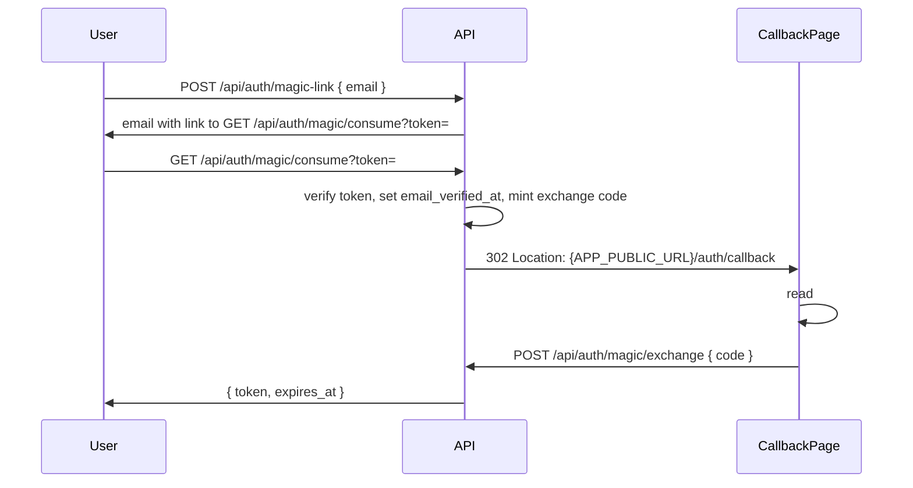

# Backend Flows

## Register / Login Flow (email + password)

1. Client fetches `GET /api/auth/language-options` to learn defaults, allowed languages, and forced values.
2. Client `POST /api/auth/register` with `{ email, password, native_language?, target_language? }`.
3. API resolves languages using this priority for each field:
   - `FORCE_*` environment value wins if set.
   - Request value if present and allowed.
   - `DEFAULT_*` environment value as final fallback.
4. API normalizes email, bcrypt-hashes password, inserts `users` row, mints opaque bearer token in `sessions`.
5. Response: `{ token, expires_at }` (201 on register, 200 on login).
6. Client sends `Authorization: Bearer <token>` on protected routes.
7. `POST /api/auth/logout` deletes the current session row.

Default languages when omitted: `native_language` ← `DEFAULT_DEFINITION_LANG`; `target_language` ← `DEFAULT_TARGET_LANG`.

## Google OAuth Flow

1. Client obtains a Google ID token (platform-specific; web uses `expo-auth-session`).
2. Client `POST /api/auth/oauth/google` with `{ "id_token": "..." }`.
3. API verifies the token against configured `GOOGLE_CLIENT_IDS` audiences (injectable verifier in tests).
4. Service resolves user: existing `user_identities` row → same user; else verified-email match → link identity; else create user + identity.
5. Response: `{ token, expires_at }`.

Account linking to an existing password user requires OAuth `emailVerified == true` and matching normalized email.

## Magic-Link Flow (fragment callback)

Preferred handoff uses a URL **fragment** so the exchange code is not logged by nginx or most proxies.

Rules:

- `POST /api/auth/magic-link` always returns **204** whether or not the email exists (no enumeration).
- Consume redirect sets `Referrer-Policy: no-referrer` and `Cache-Control: no-store`.
- Staging nginx skips access logging for `/api/auth/*` and `/auth/callback` query paths; fragment `#code=` never appears in server logs.
- **Fallback:** clients may read `?code=` from the query string if a platform cannot use fragments; codes remain single-use with short TTL (`EXCHANGE_CODE_TTL`, default 5m). Browser history may briefly retain `#code=` or `?code=`.
- Cross-device: the session is created on the device that completes `magic/exchange`.

## Add-Word Flow

1. User submits an unknown word.
2. App normalizes the word text.
3. App creates or reuses a row in `words`.
4. App creates or selects the intended row in `word_senses`.
5. Before committing the personal row, app ensures a valid `sense_translations` row exists for the requested `display_language_code` when it differs from the word's target language. If translation is unavailable after an on-demand attempt, the add is rejected with HTTP 422.
6. App upserts a row in `user_word_senses`.
7. App creates one `review_states` row if missing.
8. App may attach sense-specific examples.

Steps 6 and 7 must be idempotent: re-adding the same `(user_id, word_sense_id)` must not fail, and the `review_states` row must be created with `ON CONFLICT (user_word_sense_id) DO UPDATE SET updated_at = now()` semantics so a second call does not reset the schedule.

## Learning Items List Flow

1. Client sends `GET /api/learning-items?limit=50&descending=true&cursor=...&q=app`.
2. API derives the acting user from the bearer session.
3. API queries `user_word_senses` joined to `word_senses`, `words`, and `review_states`.
4. API excludes rows where `user_word_senses.archived_at is not null`.
5. If `q` is present, API normalizes it and filters with `words.normalized_text like q || '%'`.
6. API orders by `user_word_senses.added_at` plus `id` as a stable tie-breaker.
7. API returns up to `limit` items and an opaque `next_cursor` when another page exists.

Rules:

- `limit` defaults to 50 and is capped at 100.
- `descending` defaults to `true`; `false` returns oldest first.
- `q` is optional prefix search. It must be applied in SQL, not by loading the full user list into application memory.
- Use keyset pagination, not offset pagination.
- Do not return `total_count` in MVP.

## Lookup Flow (cache miss → enrich → persist)

This is the `POST /api/words/lookup` happy path when the global cache has no row for the lookup key:

1. App normalizes the lookup text.
2. App queries `words` by `(language_code, normalized_text[, part_of_speech])`. If a row exists, the cache-hit path loads canonical `word_senses` and `examples`, left-joining `sense_translations` and `example_translations` for the requested `display_language_code` (legacy requests may still send `definition_language_code`).
3. On a cache hit where the display language differs from the word's target language and translations are missing, app calls the enricher's `Translate` operation once per word (outside any DB transaction), validates the output, and upserts `sense_translations` / `example_translations` rows before reloading.
4. If translations are still missing (enricher unconfigured or validation dropped them), lookup returns canonical target-language text as `localized_*` fallback fields. This is not HTTP 503.
5. On a full miss, app calls the configured enricher with the normalized text, target language code, display language code, and (optional) POS.
6. The enricher returns one or more `Entry { Lemma, PartOfSpeech, Senses[] }` payloads with canonical target-language definitions and native-language translation blocks.
7. In a single transaction, app upserts each `words` row, then calls `appendSenses` which inserts canonical senses, target-language examples, and the requesting display language's translation rows. `meaning_order` continues from the current `max(meaning_order)` for that `word_id`.
8. App reloads the affected senses (joined with localized translations and examples) and returns the result.

The enricher is optional. If `ENRICH_BASE_URL` is empty, the cache-hit path still works but a full miss returns HTTP 503 "word enrichment is not available".

## Force-Generate Flow (none of these match)

This is the `POST /api/words/lookup` path with `force: true`, used when the user sees the cached options and none of them match:

1. App receives `force: true` plus either a concrete `word_id` or a concrete `part_of_speech`. `force + part_of_speech=Any + word_id=nil` is rejected as ambiguous (HTTP 400).
2. If a `word_id` is given, app loads the word's existing definitions (ordered by `meaning_order`) and asks the enricher to return one additional sense.
3. If no `word_id` is given (a concrete POS is guaranteed by step 1), app loads existing definitions for the `(language_code, normalized_text, part_of_speech)` identity and asks the enricher for one additional sense.
4. In a single transaction, app appends the new senses to the matching `words` row(s) using `appendSenses` (continuing `meaning_order`), storing canonical text plus translation rows for the requesting display language.
5. App ensures any missing on-demand translations for the display language, reloads the affected senses, and returns them.

## Review Flow

1. App queries due items by joining `review_states` to `user_word_senses`.
2. App excludes rows where `user_word_senses.archived_at is not null`.
3. User answers a prompt.
4. App inserts a row in `review_attempts`.
5. App updates `review_states.due_at`, `interval_days`, `ease_factor`, `last_reviewed_at`, `review_count`, and `lapse_count` in the same transaction.
6. App may update `user_word_senses.learning_stage`, but scheduling must still come from `review_states.due_at`.

The Go API exposes due-review reads through `GET /api/reviews/due` and batch attempt writes through `POST /api/reviews/batch`. The batch endpoint inserts attempts and updates review state in one transaction.

## HTTP Mapping

| HTTP route | Flow | Service / handler |
|------------|------|-------------------|
| `GET /api/auth/language-options` | Language options | `auth.Service.LanguageOptions` |
| `POST /api/auth/register` | Register | `auth.Service.Register` |
| `POST /api/auth/login` | Login | `auth.Service.Login` |
| `POST /api/auth/oauth/{provider}` | OAuth login | `auth.Service.LoginWithOAuth` |
| `POST /api/auth/magic-link` | Magic link request | `auth.Service.SendMagicLink` |
| `GET /api/auth/magic/consume` | Magic consume → redirect | `auth.Service.ConsumeMagicLink` |
| `POST /api/auth/magic/exchange` | Magic code → session | `auth.Service.ExchangeMagicCode` |
| `GET /api/auth/me` | Current user | context user |
| `POST /api/auth/logout` | Logout | `auth.Service.Logout` |
| `POST /api/words/lookup` (no `force`) | Lookup | `words.Service.Lookup` |
| `POST /api/words/lookup` (`force: true`) | Force-Generate | `words.Service.ForceGenerate` |
| `GET /api/learning-items` | Learning Items List | `words.Service.ListLearningItems` |
| `POST /api/learning-items` | Add-Word (steps 5-6) | `words.Service.AddLearningItem` |
| `GET /api/reviews/due` | Due Review List | `words.Service.GetDueReviewItems` |
| `POST /api/reviews/batch` | Review | `words.Service.RecordBatchReviewAttempts` |
| `GET /healthz` | liveness | n/a |
| `GET /readyz` | readiness (DB ping) | n/a |

Protected learning routes run `authMiddleware` then `requireVerified` when `REQUIRE_EMAIL_VERIFIED=true` (403 if email not verified).

## Flow Rules

- Normalize user input before inserting or looking up a word.
- `review_states.due_at` determines when an item appears again.
- `review_attempts` remains append-only even when `review_states` changes.
- Archived user items must not appear in due-review queries.
- The Add-Word and Review transactions are atomic: any failure rolls back the attempt insert together with the `review_states` update.
- Full table definitions live in `backend/docs/backend-schema-mvp.md`.
- Learning and scheduling policy details live in `backend/docs/learning-review-model.md`.
- Go service code lives under `backend/internal/words/service.go` and `backend/internal/auth/`.
