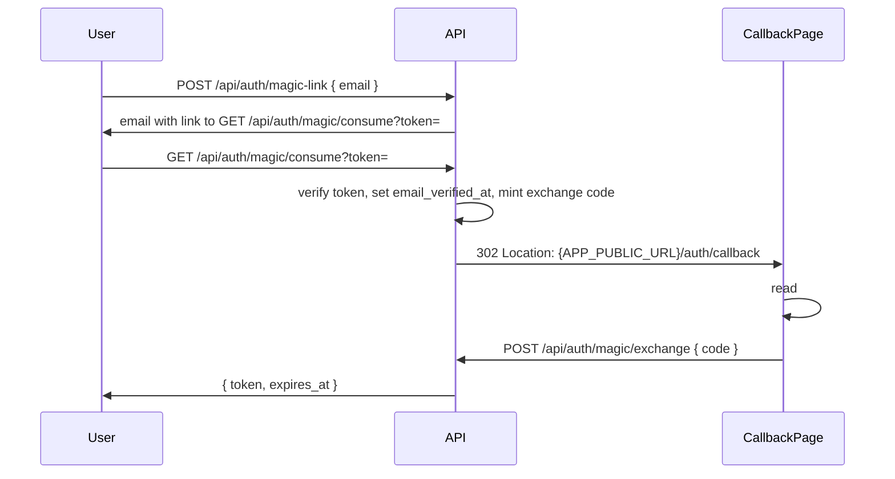

# Backend Flows

## Register / Login Flow (email + password)

1. Client fetches `GET /api/auth/language-options` to learn defaults, allowed languages, and forced values (including `ui_defaults` and `ui_forced`).
2. Client `POST /api/auth/register` with `{ email, password, native_language?, target_language?, ui_language? }`.
3. API resolves languages using this priority for each field:
   - `FORCE_*` environment value wins if set.
   - Request value if present and allowed.
   - `DEFAULT_*` environment value as final fallback.
4. API normalizes email, bcrypt-hashes password, inserts `users` row (including `ui_language`), and inserts the first `(target_language, native_language)` pair into `user_languages` with `is_active = true`.
5. Response: `{ token, expires_at }` (201 on register, 200 on login).
6. Client sends `Authorization: Bearer <token>` on protected routes.
7. `POST /api/auth/logout` deletes the current session row.

Default languages when omitted: `native_language` ← `DEFAULT_DEFINITION_LANG`; `target_language` ← `DEFAULT_TARGET_LANG`; `ui_language` ← `DEFAULT_UI_LANGUAGE`.

## Google OAuth Flow

1. Client obtains a Google ID token (platform-specific; web uses `expo-auth-session`).
2. Client `POST /api/auth/oauth/google` with `{ "id_token": "..." }`.
3. API verifies the token against configured `GOOGLE_CLIENT_IDS` audiences (injectable verifier in tests).
4. Service resolves user: existing `user_identities` row → same user; else verified-email match → link identity; else create user + identity.
5. Response: `{ token, expires_at }`.

Account linking to an existing password user requires OAuth `emailVerified == true` and matching normalized email.

## Magic-Link Flow (fragment callback)

Preferred handoff uses a URL **fragment** so the exchange code is not logged by nginx or most proxies.

Rules:

- `POST /api/auth/magic-link` always returns **204** whether or not the email exists (no enumeration).
- Consume redirect sets `Referrer-Policy: no-referrer` and `Cache-Control: no-store`.
- Staging nginx skips access logging for `/api/auth/*` and `/auth/callback` query paths; fragment `#code=` never appears in server logs.
- **Fallback:** clients may read `?code=` from the query string if a platform cannot use fragments; codes remain single-use with short TTL (`EXCHANGE_CODE_TTL`, default 5m). Browser history may briefly retain `#code=` or `?code=`.
- Cross-device: the session is created on the device that completes `magic/exchange`.

## Add-Word Flow

1. User submits an unknown word.
2. App normalizes the word text.
3. App creates or reuses a row in `words`.
4. App creates or selects the intended row in `word_senses`.
5. Before committing the personal row, app ensures a valid `sense_translations` row exists for the requested `display_language_code` when it differs from the word's target language. If translation is unavailable after an on-demand attempt, the add is rejected with HTTP 422.
6. App resolves the target deck. If the request includes `deck_id`, it validates ownership and that the deck's `target_language` matches the word's `language_code`. Otherwise it uses the active target language's default deck, creating the default deck if necessary.
7. App upserts a row in `user_word_senses` with the chosen `deck_id`.
8. App creates one `review_states` row if missing.
9. App may attach sense-specific examples.

Steps 6-8 must be idempotent: re-adding the same `(user_id, word_sense_id)` must not fail, and the `review_states` row must be created with `ON CONFLICT (user_word_sense_id) DO UPDATE SET updated_at = now()` semantics so a second call does not reset the schedule.

## Learning Items List Flow

1. Client sends `GET /api/learning-items?limit=50&descending=true&cursor=...&q=app&language_code=...&deck_id=...`.
2. API derives the acting user from the bearer session.
3. API resolves the target language. If `language_code` is omitted, the active `user_languages` row is used.
4. If `deck_id` is provided, API validates deck ownership and resolves the target language from the deck.
5. API queries `user_word_senses` joined to `word_senses`, `words`, and `review_states`, filtering to the resolved target language and deck.
6. API excludes rows where `user_word_senses.archived_at is not null`.
7. If `q` is present, API normalizes it and filters with `words.normalized_text like q || '%'`.
8. API orders by `user_word_senses.added_at` plus `id` as a stable tie-breaker.
9. API loads example sentences and their translations for each returned item.
10. API returns up to `limit` items and an opaque `next_cursor` when another page exists.

Rules:

- `limit` defaults to 50 and is capped at 100.
- `descending` defaults to `true`; `false` returns oldest first.
- `q` is optional prefix search. It must be applied in SQL, not by loading the full user list into application memory.
- Use keyset pagination, not offset pagination.
- Do not return `total_count` in MVP.

## Lookup Flow (cache miss → enrich → persist)

This is the `POST /api/words/lookup` happy path when the global cache has no row for the lookup key:

1. App normalizes the lookup text.
2. App resolves the target/display language pair. If the request omits `language_code` / `display_language_code`, the active `user_languages` row is used; otherwise the explicitly requested pair is used. Legacy fallback reads `users.target_language` / `users.native_language`.
3. App queries `words` by `(language_code, normalized_text[, part_of_speech])`. If a row exists, the cache-hit path loads canonical `word_senses` and `examples`, left-joining `sense_translations` and `example_translations` for the requested `display_language_code` (legacy requests may still send `definition_language_code`).
4. On a cache hit where the display language differs from the word's target language and translations are missing, app calls the enricher's `Translate` operation once per word (outside any DB transaction), validates the output, and upserts `sense_translations` / `example_translations` rows before reloading.
5. If translations are still missing (enricher unconfigured or validation dropped them), lookup returns canonical target-language text as `localized_*` fallback fields. This is not HTTP 503.
6. On a full miss, app calls the configured enricher with the normalized text, target language code, display language code, and (optional) POS.
7. The enricher returns one or more `Entry { Lemma, PartOfSpeech, Senses[] }` payloads with canonical target-language definitions and display-language translation blocks.
7. In a single transaction, app upserts each `words` row, then calls `appendSenses` which inserts canonical senses, target-language examples, and the requesting display language's translation rows. `meaning_order` continues from the current `max(meaning_order)` for that `word_id`.
8. App reloads the affected senses (joined with localized translations and examples) and returns the result.

The enricher is optional. If `ENRICH_BASE_URL` is empty, the cache-hit path still works but a full miss returns HTTP 503 "word enrichment is not available".

## Force-Generate Flow (none of these match)

This is the `POST /api/words/lookup` path with `force: true`, used when the user sees the cached options and none of them match:

1. App receives `force: true` plus either a concrete `word_id` or a concrete `part_of_speech`. `force + part_of_speech=Any + word_id=nil` is rejected as ambiguous (HTTP 400).
2. If a `word_id` is given, app loads the word's existing definitions (ordered by `meaning_order`) and asks the enricher to return one additional sense.
3. If no `word_id` is given (a concrete POS is guaranteed by step 1), app loads existing definitions for the `(language_code, normalized_text, part_of_speech)` identity and asks the enricher for one additional sense.
4. In a single transaction, app appends the new senses to the matching `words` row(s) using `appendSenses` (continuing `meaning_order`), storing canonical text plus translation rows for the requesting display language.
5. App ensures any missing on-demand translations for the display language, reloads the affected senses, and returns them.

## Review Flow

1. App resolves the active target language from `user_languages` (or from the explicit `language_code` query parameter). If `deck_id` is provided, it validates ownership and uses the deck's target language. It queries due items by joining `review_states` to `user_word_senses` and `words`, filtering to the resolved target language and deck.
2. App loads or creates the user's `review_settings` (lazily, with defaults).
3. App loads today's `daily_review_counts` for the user.
4. App excludes rows where `user_word_senses.archived_at is not null`, `review_states.is_suspended = true`, or `review_states.buried_until > now()`.
5. App returns Review/Relearning items first (up to `reviews_per_day - reviews_done`), then New items (up to `new_cards_per_day - new_cards_done`).
6. User answers a prompt.
7. App loads the user's `review_settings` and builds a `SchedulerConfig` (learning steps, relearning steps, desired retention, fuzz, FSRS weights).
8. App calls `CalculateNextFSRSState` with the config, which applies Anki-style step logic:
   - New + again/hard → Learning state, scheduled in minutes (learning_steps).
   - Learning → advances or resets steps; graduates to Review when exhausted.
   - Review + again → Relearning state, scheduled in minutes (relearning_steps).
   - Relearning → advances or resets steps; graduates to Review when exhausted.
   - Review + hard/good/easy → day-level FSRS scheduling with optional fuzz.
9. App inserts a row in `review_attempts` (with `metadata` including leech flag if applicable).
10. App updates `review_states` (due_at, interval_days, ease_factor, last_reviewed_at, review_count, lapse_count, fsrs_state, stability, difficulty, scheduled_days, remaining_steps, is_suspended) in the same transaction.
11. App upserts `daily_review_counts`, incrementing `new_cards_done` or `reviews_done` based on the card's previous state.
12. App checks leech condition: if `lapse_count >= leech_threshold` and `leech_action = suspend`, archives the card and sets `is_suspended = true`.
13. App buries other senses of the same word: sets `buried_until = end_of_today_utc` on all sibling `user_word_senses` sharing the same `word_id`.
14. App may update `user_word_senses.learning_stage`, but scheduling must still come from `review_states.due_at`.

The Go API exposes due-review reads through `GET /api/reviews/due` and batch attempt writes through `POST /api/reviews/batch`. The batch endpoint inserts attempts and updates review state in one transaction.

## FSRS Weight Optimization Flow

1. Client calls `POST /api/reviews/optimize-weights`.
2. API counts the user's `review_attempts`. If fewer than 1000, returns success with `weights_updated: false`.
3. API loads the user's review history (stability, difficulty, elapsed days, correctness) from `review_attempts` joined to `review_states`.
4. API runs gradient descent on the first 8 FSRS weights to minimize log-likelihood loss between predicted retrievability and actual outcomes.
5. API saves optimized weights to `review_settings.fsrs_weights` with a timestamp.
6. Subsequent reviews use the optimized weights via `SchedulerConfig`.

The optimization status can be checked via `GET /api/reviews/optimization-status`.

## HTTP Mapping

| HTTP route | Flow | Service / handler |
|------------|------|-------------------|
| `GET /api/auth/language-options` | Language options | `auth.Service.LanguageOptions` |
| `POST /api/auth/register` | Register | `auth.Service.Register` |
| `POST /api/auth/login` | Login | `auth.Service.Login` |
| `POST /api/auth/oauth/{provider}` | OAuth login | `auth.Service.LoginWithOAuth` |
| `POST /api/auth/magic-link` | Magic link request | `auth.Service.SendMagicLink` |
| `GET /api/auth/magic/consume` | Magic consume → redirect | `auth.Service.ConsumeMagicLink` |
| `POST /api/auth/magic/exchange` | Magic code → session | `auth.Service.ExchangeMagicCode` |
| `GET /api/auth/me` | Current user | context user |
| `POST /api/auth/logout` | Logout | `auth.Service.Logout` |
| `GET /api/user/languages` | List user language pairs | `auth.Service.GetUserLanguages` |
| `POST /api/user/languages` | Add user language pair | `auth.Service.AddUserLanguage` |
| `PATCH /api/user/languages/{target_language}` | Update display language | `auth.Service.UpdateUserLanguageDisplayLang` |
| `PATCH /api/user/languages/{target_language}/active` | Set active language | `auth.Service.SetActiveUserLanguage` |
| `DELETE /api/user/languages/{target_language}` | Remove user language pair | `auth.Service.RemoveUserLanguage` |
| `GET /api/user/ui-language` | Get UI language | `auth.Service.GetUILanguage` |
| `PUT /api/user/ui-language` | Set UI language | `auth.Service.SetUILanguage` |
| `GET /api/decks` | List decks | `words.Service.ListDecks` |
| `POST /api/decks` | Create deck | `words.Service.CreateDeck` |
| `PATCH /api/decks/{deck_id}` | Rename deck | `words.Service.RenameDeck` |
| `DELETE /api/decks/{deck_id}` | Delete deck | `words.Service.DeleteDeck` |
| `POST /api/decks/{deck_id}/move-items` | Move items to deck | `words.Service.MoveItemsToDeck` |
| `POST /api/words/lookup` (no `force`) | Lookup | `words.Service.Lookup` |
| `POST /api/words/lookup` (`force: true`) | Force-Generate | `words.Service.ForceGenerate` |
| `GET /api/learning-items` | Learning Items List | `words.Service.ListLearningItems` |
| `POST /api/learning-items` | Add-Word (steps 5-6) | `words.Service.AddLearningItem` |
| `GET /api/reviews/due` | Due Review List | `words.Service.GetDueReviewItems` |
| `POST /api/reviews/batch` | Review | `words.Service.RecordBatchReviewAttempts` |
| `POST /api/reviews/optimize-weights` | FSRS Weight Optimization | `words.Service.OptimizeWeights` |
| `GET /api/reviews/optimization-status` | Optimization Status | `words.Service.GetOptimizationStatus` |
| `GET /healthz` | liveness | n/a |
| `GET /readyz` | readiness (DB ping) | n/a |

Protected learning routes run `authMiddleware` then `requireVerified` when `REQUIRE_EMAIL_VERIFIED=true` (403 if email not verified).

## Flow Rules

- Normalize user input before inserting or looking up a word.
- `review_states.due_at` determines when an item appears again.
- `review_attempts` remains append-only even when `review_states` changes.
- Archived, suspended, and buried user items must not appear in due-review queries.
- Daily quotas (`new_cards_per_day`, `reviews_per_day`) are enforced by the due-review query using `daily_review_counts`.
- Learning and relearning steps use minute-level `due_at` until the card graduates to Review.
- Leech cards (lapse_count >= threshold) are suspended or tagged per `review_settings.leech_action`.
- Sibling senses of the same word are buried until end-of-day after one is reviewed.
- Interval fuzz (±25%) is applied to day-level intervals >= 2 when `fuzz_enabled` is true.
- FSRS weights can be optimized per user after 1000+ reviews via `POST /api/reviews/optimize-weights`.
- The Add-Word and Review transactions are atomic: any failure rolls back the attempt insert together with the `review_states` update.
- Full table definitions live in `backend/docs/backend-schema-mvp.md`.
- Learning and scheduling policy details live in `backend/docs/learning-review-model.md`.
- Go service code lives under `backend/internal/words/service.go`, `backend/internal/words/scheduler.go`, `backend/internal/words/batch_reviews.go`, `backend/internal/words/fsrs_optimizer.go`, and `backend/internal/auth/`.
