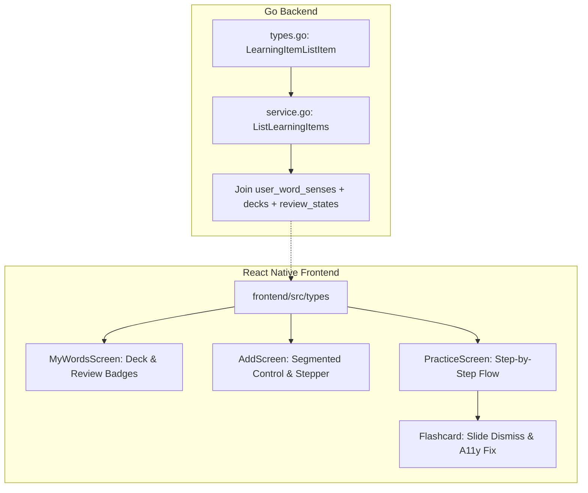

# Vocabulary Learning UX/UI Improvements Implementation Plan

> **For agentic workers:** REQUIRED SUB-SKILL: Use superpowers:subagent-driven-development to implement this plan task-by-task. Steps use checkbox (`- [ ]`) syntax for tracking.

**Goal:** Clean up the vocabulary learning user experience across Project PN by streamlining add entry points, tightening the practice flow step-by-step, adding deck/review list badges, and correcting accessibility tree issues.

**Architecture:**
The backend will extend the main learning item listing DTO to join the user's `decks` and `review_states` tables, fetching deck name and last reviewed timestamps. The React Native client will consume this expanded DTO to render badges, separate forms into a segmented control, transition the practice flow steps using local state, and disable accessibility press actions once a flashcard is flipped.

**Architecture Diagram:**


**Tech Stack:**
- Go backend (PGX, PostgreSQL)
- React Native / Expo (TypeScript)
- React Navigation (Bottom Tabs)
- React Native Animated (layout transitions)

## Global Constraints
- Target backend is local PostgreSQL with `pgcrypto` UUID primary keys.
- Keep client DTOs mirroring backend Go structs exactly.
- All files must be written in TypeScript targeting Expo Web, iOS, and Android.
- Accessibility touch targets must meet a minimum 44x44 pt standard (utilizing `hitSlop`).

---

### Task 1: Go Backend - Extend DTO and Database Query

**Files:**
- Modify: [types.go](file:///Users/hyungjuyu/Projects/iOS/Project_PN/backend/internal/words/types.go#L67-L87)
- Modify: [service.go](file:///Users/hyungjuyu/Projects/iOS/Project_PN/backend/internal/words/service.go#L376-L422)
- Test: [service_test.go](file:///Users/hyungjuyu/Projects/iOS/Project_PN/backend/internal/words/service_test.go)

**Interfaces:**
- Consumes: Database schema (`user_word_senses`, `decks`, `review_states`).
- Produces: Expanded `LearningItemListItem` struct containing `DeckID`, `DeckName`, and `LastReviewedAt`.

- [ ] **Step 1: Write the failing test**
  Add a test in `service_test.go` to assert that listing learning items returns the `deck_id`, `deck_name`, and `last_reviewed_at` fields populated correctly.
  ```go
  func TestListLearningItemsDTO(t *testing.T) {
      // Create user, deck, word, sense, user_word_sense, review_state
      // Call service.ListLearningItems
      // Assert item.DeckID == deck.ID
      // Assert item.DeckName == deck.Name
      // Assert item.LastReviewedAt != nil
  }
  ```

- [ ] **Step 2: Run test to verify it fails**
  Run: `go test ./internal/words -run TestListLearningItemsDTO`
  Expected: Compile error due to fields missing in `LearningItemListItem`.

- [ ] **Step 3: Write minimal implementation**
  Add fields to `LearningItemListItem` in `internal/words/types.go`:
  ```go
  DeckID         string     `json:"deck_id"`
  DeckName       string     `json:"deck_name"`
  LastReviewedAt *time.Time `json:"last_reviewed_at"`
  ```
  Modify the query in `internal/words/service.go` to select `uws.deck_id::text`, `d.name as deck_name`, `rs.last_reviewed_at` and join `decks d on d.id = uws.deck_id`. Update the row scan fields accordingly.

- [ ] **Step 4: Run test to verify it passes**
  Run: `go test ./internal/words -run TestListLearningItemsDTO`
  Expected: PASS

- [ ] **Step 5: Commit**
  Run:
  ```bash
  git add backend/internal/words/types.go backend/internal/words/service.go
  git commit -m "feat(backend): join decks and review_states in list learning items API"
  ```

---

### Task 2: Frontend Types & Word List Badges

**Files:**
- Modify: [types/index.ts](file:///Users/hyungjuyu/Projects/iOS/Project_PN/frontend/src/types/index.ts#L71-L91)
- Modify: [MyWordsScreen.tsx](file:///Users/hyungjuyu/Projects/iOS/Project_PN/frontend/src/features/words/MyWordsScreen.tsx#L228-L267)
- Test: [MyWordsScreen.test.tsx](file:///Users/hyungjuyu/Projects/iOS/Project_PN/frontend/src/features/words/MyWordsScreen.test.tsx)

**Interfaces:**
- Consumes: Updated backend payload.
- Produces: Visual Deck Badge (`📁 {deck_name}`) and Last Reviewed Badge on list items.

- [ ] **Step 1: Write the failing test**
  Update `MyWordsScreen.test.tsx` to assert that word cards display the deck name and relative time since reviewed.
  ```typescript
  expect(screen.getByText('📁 Core Deck')).toBeTruthy();
  expect(screen.getByText(/Reviewed/)).toBeTruthy();
  ```

- [ ] **Step 2: Run test to verify it fails**
  Run: `npm run test MyWordsScreen`
  Expected: FAIL

- [ ] **Step 3: Write minimal implementation**
  Update `LearningItemListItem` in `frontend/src/types/index.ts`:
  ```typescript
  deck_id: string;
  deck_name: string;
  last_reviewed_at: string | null;
  ```
  In `MyWordsScreen.tsx`, render the deck name badge and relative last reviewed string inside `renderItem` using a relative time formatter (e.g., standard JS or helper). Truncate definition to `numberOfLines={2}`.

- [ ] **Step 4: Run test to verify it passes**
  Run: `npm run test MyWordsScreen`
  Expected: PASS

- [ ] **Step 5: Commit**
  Run:
  ```bash
  git add frontend/src/types/index.ts frontend/src/features/words/MyWordsScreen.tsx
  git commit -m "feat(frontend): show deck name and relative review time on word list cards"
  ```

---

### Task 3: Simplify Add Screen Layout

**Files:**
- Modify: [HomeScreen.tsx](file:///Users/hyungjuyu/Projects/iOS/Project_PN/frontend/src/features/learn/HomeScreen.tsx#L223-L229)
- Modify: [AddScreen.tsx](file:///Users/hyungjuyu/Projects/iOS/Project_PN/frontend/src/navigation/AddScreen.tsx#L59-L87)
- Modify: [CaptureSection.tsx](file:///Users/hyungjuyu/Projects/iOS/Project_PN/frontend/src/features/add/CaptureSection.tsx#L70-L145)
- Delete: [AddWordModal.tsx](file:///Users/hyungjuyu/Projects/iOS/Project_PN/frontend/src/components/AddWordModal.tsx)
- Test: [AddScreen.test.tsx](file:///Users/hyungjuyu/Projects/iOS/Project_PN/frontend/src/navigation/AddScreen.test.tsx)

**Interfaces:**
- Consumes: React Navigation `navigation` object.
- Produces: Single unified entry point on Home and Tab switching Add Screen.

- [ ] **Step 1: Write the failing test**
  Update `AddScreen.test.tsx` to assert that a tab/segmented control switch toggles between "From Passage" and "Single Word", and that sections are rendered step-by-step (stepper mode).

- [ ] **Step 2: Run test to verify it fails**
  Run: `npm run test AddScreen`
  Expected: FAIL

- [ ] **Step 3: Write minimal implementation**
  - Delete `AddWordModal.tsx`.
  - In `HomeScreen.tsx`, change `Add Word` button `onPress` to `navigation.navigate('Add')`.
  - In `AddScreen.tsx`, introduce a segmented control (using standard `Pressable` chips) to toggle `activeTab` ('passage' | 'manual').
  - In `CaptureSection.tsx`, wrap sections conditionally:
    - Step 1: Passage Input
    - Step 2: Tappable Passage (only visible if `passage.trim() !== ''`)
    - Step 3: Part of Speech select + Add Selected Button (only visible if `selected.size > 0`)

- [ ] **Step 4: Run test to verify it passes**
  Run: `npm run test AddScreen`
  Expected: PASS

- [ ] **Step 5: Commit**
  Run:
  ```bash
  git rm frontend/src/components/AddWordModal.tsx
  git add frontend/src/features/learn/HomeScreen.tsx frontend/src/navigation/AddScreen.tsx frontend/src/features/add/CaptureSection.tsx
  git commit -m "refactor(frontend): simplify add flows with tab switching and stepper passage input"
  ```

---

### Task 4: Practice Flow Step-by-Step Transition

**Files:**
- Modify: [PracticeScreen.tsx](file:///Users/hyungjuyu/Projects/iOS/Project_PN/frontend/src/features/practice/PracticeScreen.tsx#L585-L675)
- Test: [PracticeScreen.test.ts](file:///Users/hyungjuyu/Projects/iOS/Project_PN/frontend/src/features/practice/PracticeScreen.test.ts)

**Interfaces:**
- Consumes: Card flip state.
- Produces: Progressive reveal of rating buttons.

- [ ] **Step 1: Write the failing test**
  Update `PracticeScreen.test.ts` to assert that when a card flips, rating buttons are initially hidden until a separate "Rate Recall" button is pressed.

- [ ] **Step 2: Run test to verify it fails**
  Run: `npm run test PracticeScreen`
  Expected: FAIL

- [ ] **Step 3: Write minimal implementation**
  In `PracticeScreen.tsx`:
  - Add state `showRatingBar = false`.
  - On card flip (`isFlipped === true`):
    - If `showRatingBar` is false, show a button labeled "Rate Recall".
    - Tapping "Rate Recall" sets `showRatingBar = true`.
    - If `showRatingBar` is true, show the `RatingBar`.
  - In `confirmGrade`, reset `showRatingBar` to `false`.

- [ ] **Step 4: Run test to verify it passes**
  Run: `npm run test PracticeScreen`
  Expected: PASS

- [ ] **Step 5: Commit**
  Run:
  ```bash
  git add frontend/src/features/practice/PracticeScreen.tsx
  git commit -m "feat(frontend): split practice reveal and rating buttons to reduce cognitive load"
  ```

---

### Task 5: Dismiss Animations & Transitions

**Files:**
- Modify: [Flashcard.tsx](file:///Users/hyungjuyu/Projects/iOS/Project_PN/frontend/src/features/practice/Flashcard.tsx)
- Modify: [PracticeScreen.tsx](file:///Users/hyungjuyu/Projects/iOS/Project_PN/frontend/src/features/practice/PracticeScreen.tsx)

**Interfaces:**
- Consumes: Rating selection trigger.
- Produces: Card slide-out visual transition.

- [ ] **Step 1: Write the failing test**
  Update `Flashcard.test.tsx` to assert that dismiss/slide animations are triggered when the card rating action begins.

- [ ] **Step 2: Run test to verify it fails**
  Run: `npm run test Flashcard`
  Expected: FAIL

- [ ] **Step 3: Write minimal implementation**
  - In `Flashcard.tsx`, add an `Animated.Value` for horizontal translation (`translateX`).
  - Add a function `animateDismiss(direction: 'left' | 'right', callback: () => void)` that slides the card out horizontally.
  - In `PracticeScreen.tsx`, trigger `animateDismiss` on the card ref upon rating selection. In its callback, call `confirmGrade` to load the next card.

- [ ] **Step 4: Run test to verify it passes**
  Run: `npm run test PracticeScreen`
  Expected: PASS

- [ ] **Step 5: Commit**
  Run:
  ```bash
  git add frontend/src/features/practice/Flashcard.tsx frontend/src/features/practice/PracticeScreen.tsx
  git commit -m "feat(frontend): add satisfying card slide-out exit transition when grading a card"
  ```

---

### Task 6: Accessibility Semantics & SpeakButton Touch Targets

**Files:**
- Modify: [Flashcard.tsx](file:///Users/hyungjuyu/Projects/iOS/Project_PN/frontend/src/features/practice/Flashcard.tsx#L274-L313)
- Modify: [SpeakButton.tsx](file:///Users/hyungjuyu/Projects/iOS/Project_PN/frontend/src/components/SpeakButton.tsx#L30-L40)

**Interfaces:**
- Consumes: Accessibility framework properties.
- Produces: Clean accessibility tree for flipped cards and expanded touch targets.

- [ ] **Step 1: Write the failing test**
  Write accessibility assertions in `Flashcard.test.tsx` confirming that the card press action is disabled when flipped.

- [ ] **Step 2: Run test to verify it fails**
  Run: `npm run test Flashcard`
  Expected: FAIL

- [ ] **Step 3: Write minimal implementation**
  - In `Flashcard.tsx`, set `disabled={isFlipped}` on the main `Pressable` wrapper.
  - In `SpeakButton.tsx`, add the prop `hitSlop={{ top: 12, bottom: 12, left: 12, right: 12 }}` to the standard `Pressable`.

- [ ] **Step 4: Run test to verify it passes**
  Run: `npm run test Flashcard`
  Expected: PASS

- [ ] **Step 5: Commit**
  Run:
  ```bash
  git add frontend/src/features/practice/Flashcard.tsx frontend/src/components/SpeakButton.tsx
  git commit -m "accessibility(frontend): disable main card press when flipped and increase SpeakButton hitSlop"
  ```
