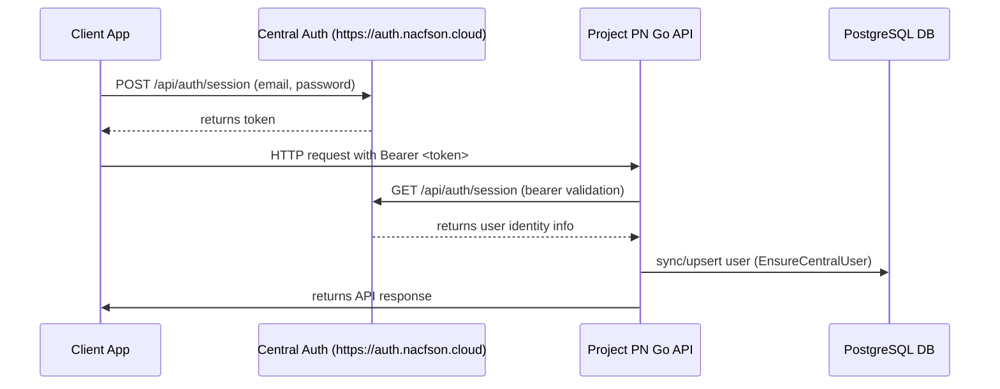

# Central Auth Only Migration Implementation Plan

> **For agentic workers:** REQUIRED SUB-SKILL: Use superpowers:subagent-driven-development to implement this plan task-by-task. Steps use checkbox (`- [ ]`) syntax for tracking.

**Goal:** Permanently migrate the authentication system to use only the central auth platform (Brain Auth), completely removing local authentication registration, email verification, password login, and session endpoints.

**Architecture:** Rely exclusively on the central auth platform at `https://auth.nacfson.cloud` for token creation and user authentication. The backend HTTP layer will validate incoming tokens via `CentralClient.ValidateSession` and synchronize/cache user accounts in the local PostgreSQL DB on demand. All local email/password login, register, and email-verification routes, middleware, and logic are deprecated and removed.

**Architecture Diagram:**



**Tech Stack:** Go 1.22+, PostgreSQL, React Native / Expo.

**Global Constraints:**
- All Go code must compile and pass tests.
- Standalone local authentication logic (register, login, magic links, local sessions table lookup) is completely eliminated.
- Ensure all screens use responsive flexbox layouts.

---

### Task 1: Go Backend - Remove Local Auth Configurations and Enforce Central Mode

**Files:**
- Modify: [backend/internal/config/config.go](file:///Users/hyungjuyu/Projects/iOS/Project_PN/backend/internal/config/config.go)
- Modify: [backend/cmd/api/main.go](file:///Users/hyungjuyu/Projects/iOS/Project_PN/backend/cmd/api/main.go)

**Interfaces:**
- Consumes: Environment variable `CENTRAL_AUTH_URL` (mandatory).
- Produces: Eliminates `AuthMode` configuration.

- [ ] **Step 1: Update configuration loader**
Modify [backend/internal/config/config.go](file:///Users/hyungjuyu/Projects/iOS/Project_PN/backend/internal/config/config.go) to remove `AuthMode` and `defaultAuthMode`. Ensure `CentralAuthURL` is parsed directly.
```diff
@@ -26,9 +26,7 @@
 	defaultSessionTTL           = 720 * time.Hour
 	defaultEmailVerificationTTL = 24 * time.Hour
 	defaultEmailProvider        = "log"
 	defaultAppPublicURL         = "http://localhost:8080"
-	defaultAuthMode             = "local"
 
 	// Web (Expo dev) and Tauri desktop WebView origins that may call the API.
@@ -58,9 +56,7 @@
 	ForceUILang    string
 
 	AllowedOrigins []string
 
-	AuthMode              string
 	CentralAuthURL        string
 	CentralAuthInternalURL string
 
@@ -97,9 +93,7 @@
 		ForceUILang:            envOrDefault("FORCE_UI_LANGUAGE", defaultForceUILang),
 
 		AllowedOrigins: splitAndTrim(envOrDefault("ALLOWED_ORIGINS", defaultAllowedOrigins)),
 
-		AuthMode:               strings.ToLower(envOrDefault("AUTH_MODE", defaultAuthMode)),
 		CentralAuthURL:         strings.TrimRight(os.Getenv("CENTRAL_AUTH_URL"), "/"),
 		CentralAuthInternalURL: strings.TrimRight(os.Getenv("CENTRAL_AUTH_INTERNAL_URL"), "/"),
```

- [ ] **Step 2: Update main entrypoint**
Modify [backend/cmd/api/main.go](file:///Users/hyungjuyu/Projects/iOS/Project_PN/backend/cmd/api/main.go) to remove local auth modes and construct the central client unconditionally.
```diff
@@ -51,20 +51,13 @@
 		ForceTargetLang:        cfg.ForceTargetLang,
 		ForceUILang:            cfg.ForceUILang,
 		AppPublicURL:           cfg.AppPublicURL,
 	})
 	var centralAuth *auth.CentralClient
-	if cfg.AuthMode == "central" {
-		centralAuthURL := cfg.CentralAuthInternalURL
-		if centralAuthURL == "" {
-			centralAuthURL = cfg.CentralAuthURL
-		}
-		if centralAuthURL == "" {
-			slog.Error("CENTRAL_AUTH_URL or CENTRAL_AUTH_INTERNAL_URL is required when AUTH_MODE=central")
-			os.Exit(1)
-		}
-		centralAuth = auth.NewCentralClient(centralAuthURL, nil)
-		slog.Info("using central auth URL", "url", centralAuthURL, "public_url", cfg.CentralAuthURL)
-	} else if cfg.AuthMode != "local" {
-		slog.Error("unsupported AUTH_MODE", "mode", cfg.AuthMode)
+	centralAuthURL := cfg.CentralAuthInternalURL
+	if centralAuthURL == "" {
+		centralAuthURL = cfg.CentralAuthURL
+	}
+	if centralAuthURL == "" {
+		slog.Error("CENTRAL_AUTH_URL or CENTRAL_AUTH_INTERNAL_URL is required")
 		os.Exit(1)
 	}
+	centralAuth = auth.NewCentralClient(centralAuthURL, nil)
+	slog.Info("using central auth URL", "url", centralAuthURL, "public_url", cfg.CentralAuthURL)
 
 	wordsService := words.New(pool, enricher, cfg.DefaultUserID, cfg.DefaultTargetLang, cfg.DefaultDefinitionLang)
 
 	server := &http.Server{
 		Addr: cfg.AppAddr,
 		Handler: httpapi.NewRouter(httpapi.Dependencies{
 			DB:             pool,
 			Words:          wordsService,
 			Auth:           authService,
-			AuthMode:       cfg.AuthMode,
 			CentralAuth:    centralAuth,
 			AllowedOrigins: cfg.AllowedOrigins,
 		}),
 		ReadHeaderTimeout: 5 * time.Second,
 	}
```

- [ ] **Step 3: Compile the backend to verify**
Run: `go build -o /dev/null ./cmd/api` from the `backend/` directory.
Expected: Compilation succeeds.

---

### Task 2: Go Backend - Simplify Auth Router, Middleware and Handlers

**Files:**
- Modify: [backend/internal/http/router.go](file:///Users/hyungjuyu/Projects/iOS/Project_PN/backend/internal/http/router.go)
- Modify: [backend/internal/http/auth_middleware.go](file:///Users/hyungjuyu/Projects/iOS/Project_PN/backend/internal/http/auth_middleware.go)
- Modify: [backend/internal/http/auth_handler.go](file:///Users/hyungjuyu/Projects/iOS/Project_PN/backend/internal/http/auth_handler.go)

**Interfaces:**
- Consumes: Dependencies struct (without `AuthMode`), `auth.CentralClient`.
- Produces: Removes local auth HTTP endpoints.

- [ ] **Step 1: Simplify Auth Middleware**
Modify [backend/internal/http/auth_middleware.go](file:///Users/hyungjuyu/Projects/iOS/Project_PN/backend/internal/http/auth_middleware.go) to remove local auth session lookups and only support central session validation.
```go
package httpapi

import (
	"context"
	"net/http"
	"strings"

	"project-pn/internal/auth"
)

func authMiddleware(svc *auth.Service, central *auth.CentralClient) func(http.Handler) http.Handler {
	return func(next http.Handler) http.Handler {
		return http.HandlerFunc(func(w http.ResponseWriter, r *http.Request) {
			token := bearerToken(r)
			if token == "" {
				writeError(w, http.StatusUnauthorized, "unauthorized")
				return
			}
			if central == nil {
				writeError(w, http.StatusInternalServerError, "central auth is not configured")
				return
			}
			session, err := central.ValidateSession(r.Context(), token)
			if err != nil {
				writeError(w, http.StatusUnauthorized, "unauthorized")
				return
			}
			user, err := svc.EnsureCentralUser(r.Context(), session.User)
			if err != nil {
				writeError(w, http.StatusInternalServerError, "internal error")
				return
			}
			next.ServeHTTP(w, r.WithContext(withUser(r.Context(), user)))
		})
	}
}

func requireVerified() func(http.Handler) http.Handler {
	return func(next http.Handler) http.Handler {
		return http.HandlerFunc(func(w http.ResponseWriter, r *http.Request) {
			user, ok := userFromContext(r.Context())
			if !ok || !user.IsEmailVerified() {
				writeError(w, http.StatusForbidden, "email verification required")
				return
			}
			next.ServeHTTP(w, r)
		})
	}
}

func bearerToken(r *http.Request) string {
	header := strings.TrimSpace(r.Header.Get("Authorization"))
	if !strings.HasPrefix(header, "Bearer ") {
		return ""
	}
	return strings.TrimSpace(header[7:])
}

func writeRateLimited(w http.ResponseWriter) {
	writeError(w, http.StatusTooManyRequests, "too many requests")
}

func rateLimitResponse(w http.ResponseWriter, _ *http.Request) {
	writeRateLimited(w)
}
```

- [ ] **Step 2: Simplify Auth Handlers**
Modify [backend/internal/http/auth_handler.go](file:///Users/hyungjuyu/Projects/iOS/Project_PN/backend/internal/http/auth_handler.go) to remove unused login, register, verify-email, and local logout handlers.
```go
package httpapi

import (
	"encoding/json"
	"net/http"
	"time"

	"project-pn/internal/auth"
)

type authHandler struct {
	svc *auth.Service
}

type meResponse struct {
	ID              string            `json:"id"`
	Email           string            `json:"email"`
	EmailVerified   bool              `json:"email_verified"`
	EmailVerifiedAt *time.Time        `json:"email_verified_at,omitempty"`
	NativeLanguage  string            `json:"native_language"`
	TargetLanguage  string            `json:"target_language"`
	UILanguage      string            `json:"ui_language"`
	ActiveLanguage  auth.UserLanguage `json:"active_language"`
}

func (h *authHandler) languageOptions(w http.ResponseWriter, r *http.Request) {
	writeJSON(w, http.StatusOK, h.svc.LanguageOptions())
}

func centralLogout(central *auth.CentralClient) http.HandlerFunc {
	return func(w http.ResponseWriter, r *http.Request) {
		if central == nil {
			writeError(w, http.StatusInternalServerError, "central auth is not configured")
			return
		}
		token := bearerToken(r)
		if err := central.Logout(r.Context(), token); err != nil {
			writeError(w, http.StatusUnauthorized, "unauthorized")
			return
		}
		w.WriteHeader(http.StatusNoContent)
	}
}

func (h *authHandler) me(w http.ResponseWriter, r *http.Request) {
	user, ok := userFromContext(r.Context())
	if !ok {
		writeError(w, http.StatusUnauthorized, "unauthorized")
		return
	}
	writeJSON(w, http.StatusOK, meResponse{
		ID:              user.ID,
		Email:           user.Email,
		EmailVerified:   user.IsEmailVerified(),
		EmailVerifiedAt: user.EmailVerifiedAt,
		NativeLanguage:  user.NativeLanguage,
		TargetLanguage:  user.TargetLanguage,
		UILanguage:      user.UILanguage,
		ActiveLanguage:  user.ActiveLanguage,
	})
}
```

- [ ] **Step 3: Update Routing**
Modify [backend/internal/http/router.go](file:///Users/hyungjuyu/Projects/iOS/Project_PN/backend/internal/http/router.go) to remove all registration and local auth endpoints, unconditionally applying the central middleware.
```diff
@@ -18,9 +18,7 @@
 type Dependencies struct {
 	DB             *pgxpool.Pool
 	Words          *words.Service
 	Auth           *auth.Service
-	AuthMode       string
 	CentralAuth    *auth.CentralClient
 	AllowedOrigins []string
 }
@@ -53,28 +51,15 @@
 
 	var authMW func(http.Handler) http.Handler
 	if deps.Auth != nil {
-		if deps.AuthMode == "" {
-			deps.AuthMode = "local"
-		}
-		authMW = authMiddlewareForMode(deps.Auth, deps.CentralAuth, deps.AuthMode)
+		authMW = authMiddleware(deps.Auth, deps.CentralAuth)
 		ah := &authHandler{svc: deps.Auth}
 
 		r.Route("/api/auth", func(authRouter chi.Router) {
 			authRouter.Get("/language-options", ah.languageOptions)
-			if deps.AuthMode != "central" {
-				authRouter.With(authIPRateLimit(), authEmailRateLimit()).Post("/register", ah.register)
-				authRouter.With(authIPRateLimit(), authEmailRateLimit()).Post("/login", ah.login)
-				authRouter.With(authIPRateLimit(), authEmailRateLimit()).Post("/verify-email/request", ah.requestVerificationEmail)
-				authRouter.With(consumeIPRateLimit()).Get("/verify-email", ah.verifyEmail)
-			}
 
 			authRouter.Group(func(protected chi.Router) {
 				protected.Use(authMW)
 				protected.Get("/me", ah.me)
-				if deps.AuthMode == "central" {
-					protected.Post("/logout", centralLogout(deps.CentralAuth))
-				} else {
-					protected.Post("/logout", ah.logout)
-				}
+				protected.Post("/logout", centralLogout(deps.CentralAuth))
 			})
 		})
```

- [ ] **Step 4: Compile and check Go compilation**
Run: `go build -o /dev/null ./cmd/api` from the `backend/` directory.
Expected: Compilation succeeds.

---

### Task 3: Go Backend - Simplify Auth Service and Clean Up Tests

**Files:**
- Modify: [backend/internal/auth/service.go](file:///Users/hyungjuyu/Projects/iOS/Project_PN/backend/internal/auth/service.go)
- Modify: [backend/internal/auth/service_test.go](file:///Users/hyungjuyu/Projects/iOS/Project_PN/backend/internal/auth/service_test.go)
- Modify: [backend/internal/http/auth_handler_test.go](file:///Users/hyungjuyu/Projects/iOS/Project_PN/backend/internal/http/auth_handler_test.go)

**Interfaces:**
- Consumes: `auth.Service`.
- Produces: Removes deprecated Go authentication and verification methods.

- [ ] **Step 1: Simplify Go Service**
Modify [backend/internal/auth/service.go](file:///Users/hyungjuyu/Projects/iOS/Project_PN/backend/internal/auth/service.go) to remove `Register`, `Login`, `IssueSession`, `Authenticate`, `Logout`, `RequestVerificationEmail`, `VerifyEmail` and associated local auth methods/helpers. Keep only language resolution, active language, and central sync mechanisms.
```go
package auth

import (
	"context"
	"errors"
	"fmt"

	"github.com/jackc/pgx/v5"
	"github.com/jackc/pgx/v5/pgconn"
	"github.com/jackc/pgx/v5/pgxpool"

	"project-pn/internal/email"
)

type querier interface {
	QueryRow(ctx context.Context, sql string, args ...any) pgx.Row
	Exec(ctx context.Context, sql string, args ...any) (pgconn.CommandTag, error)
}

type Service struct {
	pool                   *pgxpool.Pool
	mailer                 email.Mailer
	defaultDefinitionLang  string
	defaultTargetLang      string
	defaultUILang          string
	allowedDefinitionLangs []string
	allowedTargetLangs     []string
	allowedUILangs         []string
	forceDefinitionLang    string
	forceTargetLang        string
	forceUILang            string
	appPublicURL           string
}

type Options struct {
	DefaultDefinitionLang  string
	DefaultTargetLang      string
	DefaultUILang          string
	AllowedDefinitionLangs []string
	AllowedTargetLangs     []string
	AllowedUILangs         []string
	ForceDefinitionLang    string
	ForceTargetLang        string
	ForceUILang            string
	AppPublicURL           string
}

func New(pool *pgxpool.Pool, mailer email.Mailer, opts Options) *Service {
	return &Service{
		pool:                   pool,
		mailer:                 mailer,
		defaultDefinitionLang:  opts.DefaultDefinitionLang,
		defaultTargetLang:      opts.DefaultTargetLang,
		defaultUILang:          opts.DefaultUILang,
		allowedDefinitionLangs: opts.AllowedDefinitionLangs,
		allowedTargetLangs:     opts.AllowedTargetLangs,
		allowedUILangs:         opts.AllowedUILangs,
		forceDefinitionLang:    opts.ForceDefinitionLang,
		forceTargetLang:        opts.ForceTargetLang,
		forceUILang:            opts.ForceUILang,
		appPublicURL:           opts.AppPublicURL,
	}
}

func (s *Service) AppPublicURL() string {
	return s.appPublicURL
}

func (s *Service) LanguageOptions() LanguageOptions {
	return LanguageOptions{
		Defaults: LanguagePair{
			TargetLanguage:     s.defaultTargetLang,
			DefinitionLanguage: s.defaultDefinitionLang,
		},
		Allowed: AllowedLanguages{
			TargetLanguages:     s.allowedTargetLangs,
			DefinitionLanguages: s.allowedDefinitionLangs,
			UILanguages:         s.allowedUILangs,
		},
		Forced: LanguagePair{
			TargetLanguage:     s.forceTargetLang,
			DefinitionLanguage: s.forceDefinitionLang,
		},
		UIDefaults: s.defaultUILang,
		UIForced:   s.forceUILang,
	}
}

func (s *Service) resolveTargetLang(requested string) (string, error) {
	if s.forceTargetLang != "" {
		return s.forceTargetLang, nil
	}
	if requested == "" {
		return s.defaultTargetLang, nil
	}
	if len(s.allowedTargetLangs) > 0 && !contains(s.allowedTargetLangs, requested) {
		return "", ErrInvalidTargetLang
	}
	return requested, nil
}

func (s *Service) resolveDefinitionLang(requested string) (string, error) {
	if s.forceDefinitionLang != "" {
		return s.forceDefinitionLang, nil
	}
	if requested == "" {
		return s.defaultDefinitionLang, nil
	}
	if len(s.allowedDefinitionLangs) > 0 && !contains(s.allowedDefinitionLangs, requested) {
		return "", ErrInvalidDefinitionLang
	}
	return requested, nil
}

func (s *Service) resolveUILang(requested string) (string, error) {
	if s.forceUILang != "" {
		return s.forceUILang, nil
	}
	if requested == "" {
		return s.defaultUILang, nil
	}
	if len(s.allowedUILangs) > 0 && !contains(s.allowedUILangs, requested) {
		return "", ErrInvalidUILang
	}
	return requested, nil
}

func contains(arr []string, s string) bool {
	for _, val := range arr {
		if val == s {
			return true
		}
	}
	return false
}

func isUniqueViolation(err error) bool {
	var pgErr *pgconn.PgError
	if errors.As(err, &pgErr) {
		return pgErr.Code == "23505"
	}
	return false
}
```

- [ ] **Step 2: Clean up HTTP Auth Handler Tests**
Modify [backend/internal/http/auth_handler_test.go](file:///Users/hyungjuyu/Projects/iOS/Project_PN/backend/internal/http/auth_handler_test.go) to remove tests testing local login/registration, leaving only tests for language options and basic protected-route validation.
```go
package httpapi

import (
	"encoding/json"
	"net/http"
	"net/http/httptest"
	"os"
	"path/filepath"
	"runtime"
	"strings"
	"testing"

	"project-pn/internal/auth"
	"project-pn/internal/config"
	"project-pn/internal/db"
	"project-pn/internal/email"
	"project-pn/internal/enrich"
	"project-pn/internal/migrations"
	"project-pn/internal/words"
)

func testAuthRouter(t *testing.T) (http.Handler, *auth.Service) {
	t.Helper()

	databaseURL := os.Getenv("DATABASE_URL")
	if databaseURL == "" {
		t.Skip("DATABASE_URL is required for auth HTTP tests")
	}

	ctx := context.Background()
	migrationsPath := "file://" + repoPath(t, "db", "migrations")
	if err := migrations.Up(migrationsPath, databaseURL); err != nil {
		t.Fatalf("up migration: %v", err)
	}

	pool, err := db.Open(ctx, databaseURL)
	if err != nil {
		t.Fatalf("open database: %v", err)
	}
	t.Cleanup(pool.Close)

	cfg := config.Load()
	authSvc := auth.New(pool, email.NewLog(), auth.Options{
		DefaultDefinitionLang:  cfg.DefaultDefinitionLang,
		DefaultTargetLang:      cfg.DefaultTargetLang,
		DefaultUILang:          cfg.UILang,
		AllowedDefinitionLangs: cfg.AllowedDefinitionLangs,
		AllowedTargetLangs:     cfg.AllowedTargetLangs,
		AllowedUILangs:         cfg.AllowedUILangs,
		ForceDefinitionLang:    cfg.ForceDefinitionLang,
		ForceTargetLang:        cfg.ForceTargetLang,
		ForceUILang:            cfg.ForceUILang,
		AppPublicURL:           "http://localhost:8080",
	})
	wordsSvc := words.New(pool, enrich.NewOpenAI("", "", ""), cfg.DefaultUserID, cfg.DefaultTargetLang, cfg.DefaultDefinitionLang)

	router := NewRouter(Dependencies{
		DB:             pool,
		Words:          wordsSvc,
		Auth:           authSvc,
		AllowedOrigins: []string{"http://localhost:8081"},
	})
	return router, authSvc
}

func TestLanguageOptionsEndpoint(t *testing.T) {
	router, _ := testAuthRouter(t)

	req := httptest.NewRequest(http.MethodGet, "/api/auth/language-options", nil)
	rec := httptest.NewRecorder()
	router.ServeHTTP(rec, req)
	if rec.Code != http.StatusOK {
		t.Fatalf("language-options: expected 200, got %d body=%s", rec.Code, rec.Body.String())
	}

	var opts auth.LanguageOptions
	if err := json.NewDecoder(rec.Body).Decode(&opts); err != nil {
		t.Fatalf("decode language-options: %v", err)
	}
	if opts.Defaults.TargetLanguage == "" || opts.Defaults.DefinitionLanguage == "" {
		t.Fatalf("expected non-empty defaults: %+v", opts.Defaults)
	}
}

func TestProtectedRoutesRequireAuth(t *testing.T) {
	router, _ := testAuthRouter(t)

	for _, path := range []string{"/api/words/lookup", "/api/learning-items", "/api/auth/me"} {
		req := httptest.NewRequest(http.MethodPost, path, strings.NewReader(`{"text":"x"}`))
		if path == "/api/auth/me" {
			req = httptest.NewRequest(http.MethodGet, path, nil)
		}
		rec := httptest.NewRecorder()
		router.ServeHTTP(rec, req)
		if rec.Code != http.StatusUnauthorized {
			t.Fatalf("%s: expected 401, got %d", path, rec.Code)
		}
	}
}

func repoPath(t *testing.T, parts ...string) string {
	t.Helper()

	_, file, _, ok := runtime.Caller(0)
	if !ok {
		t.Fatal("resolve current file")
	}

	root := filepath.Clean(filepath.Join(filepath.Dir(file), "..", ".."))
	pathParts := append([]string{root}, parts...)
	return filepath.Join(pathParts...)
}
```

- [ ] **Step 3: Clean up Service Tests**
Modify [backend/internal/auth/service_test.go](file:///Users/hyungjuyu/Projects/iOS/Project_PN/backend/internal/auth/service_test.go) to remove tests testing local login/registration, leaving only central user sync tests and language configuration tests.
```go
package auth

import (
	"context"
	"os"
	"path/filepath"
	"runtime"
	"testing"

	"project-pn/internal/db"
	"project-pn/internal/email"
	"project-pn/internal/migrations"
)

func testService(t *testing.T) *Service {
	t.Helper()
	return testServiceWithOptions(t, Options{
		DefaultDefinitionLang:  "ko",
		DefaultTargetLang:      "en",
		DefaultUILang:          "en",
		AllowedDefinitionLangs: nil,
		AllowedTargetLangs:     nil,
		AllowedUILangs:         nil,
		ForceDefinitionLang:    "",
		ForceTargetLang:        "",
		ForceUILang:            "",
		AppPublicURL:           "http://localhost:8080",
	})
}

func testServiceWithOptions(t *testing.T, opts Options) *Service {
	t.Helper()

	databaseURL := os.Getenv("DATABASE_URL")
	if databaseURL == "" {
		t.Skip("DATABASE_URL is required for auth integration tests")
	}

	ctx := context.Background()
	migrationsPath := "file://" + repoPath(t, "db", "migrations")
	if err := migrations.Up(migrationsPath, databaseURL); err != nil {
		t.Fatalf("up migration: %v", err)
	}

	pool, err := db.Open(ctx, databaseURL)
	if err != nil {
		t.Fatalf("open database: %v", err)
	}
	t.Cleanup(pool.Close)

	return New(pool, email.NewLog(), opts)
}

func TestNormalizeEmail(t *testing.T) {
	t.Parallel()
	if got := NormalizeEmail("  User@Example.COM "); got != "user@example.com" {
		t.Fatalf("expected normalized email, got %q", got)
	}
}

func TestEnsureCentralUser(t *testing.T) {
	svc := testService(t)
	ctx := context.Background()
	emailAddr := uniqueEmail("central")

	central := CentralUser{
		ID:    "provider-id-123",
		Email: emailAddr,
	}

	user, err := svc.EnsureCentralUser(ctx, central)
	if err != nil {
		t.Fatalf("EnsureCentralUser: %v", err)
	}

	if user.Email != emailAddr {
		t.Fatalf("expected email %q, got %q", emailAddr, user.Email)
	}

	if !user.IsEmailVerified() {
		t.Fatal("expected central user to be verified locally")
	}
}

func uniqueEmail(prefix string) string {
	return prefix + "@example.com"
}

func repoPath(t *testing.T, parts ...string) string {
	t.Helper()
	_, file, _, ok := runtime.Caller(0)
	if !ok {
		t.Fatal("resolve current file")
	}
	root := filepath.Clean(filepath.Join(filepath.Dir(file), "..", ".."))
	pathParts := append([]string{root}, parts...)
	return filepath.Join(pathParts...)
}
```

- [ ] **Step 4: Run Go tests**
Run: `go test ./...` from the `backend/` directory.
Expected: PASS

---

### Task 4: Frontend - Remove Local Auth Configurations and APIs

**Files:**
- Modify: [frontend/src/config.ts](file:///Users/hyungjuyu/Projects/iOS/Project_PN/frontend/src/config.ts)
- Modify: [frontend/src/api/auth.ts](file:///Users/hyungjuyu/Projects/iOS/Project_PN/frontend/src/api/auth.ts)

**Interfaces:**
- Consumes: Environment variable `EXPO_PUBLIC_CENTRAL_AUTH_URL` (mandatory).
- Produces: Eliminates local-auth code paths on frontend client.

- [ ] **Step 1: Clean Config**
Modify [frontend/src/config.ts](file:///Users/hyungjuyu/Projects/iOS/Project_PN/frontend/src/config.ts) to remove `AUTH_MODE`, `IS_CENTRAL_AUTH`, ensuring `CENTRAL_AUTH_URL` is parsed directly.
```diff
@@ -57,24 +57,11 @@
 function stripTrailingSlash(value: string): string {
   return value.replace(/\/+$/, '');
 }
 
-function resolveAuthMode(): 'local' | 'central' {
-  const mode = (process.env.EXPO_PUBLIC_AUTH_MODE ?? 'local').trim().toLowerCase();
-  return mode === 'central' ? 'central' : 'local';
-}
-
 function resolveCentralAuthUrl(): string {
   const fromEnv = process.env.EXPO_PUBLIC_CENTRAL_AUTH_URL;
   return fromEnv ? stripTrailingSlash(fromEnv.trim()) : '';
 }
 
 export const API_BASE_URL = resolveApiBaseUrl();
 export const API_BASE_URLS = [
   API_BASE_URL,
   ...resolveApiFallbackUrls().filter((url) => url !== API_BASE_URL),
 ];
-export const AUTH_MODE = resolveAuthMode();
 export const CENTRAL_AUTH_URL = resolveCentralAuthUrl();
-export const IS_CENTRAL_AUTH = AUTH_MODE === 'central';
```

- [ ] **Step 2: Simplify Auth APIs**
Modify [frontend/src/api/auth.ts](file:///Users/hyungjuyu/Projects/iOS/Project_PN/frontend/src/api/auth.ts) to remove local auth methods `register`, `requestVerificationEmail` and make `login` request directly to the central authentication endpoint.
```typescript
import {
	CENTRAL_AUTH_URL,
} from '../config';
import type {
	LanguageOptionsResponse,
	LoginRequest,
	MeResponse,
	SessionResponse,
} from '../types/auth';
import { ApiError, getJson, postNoContent } from './client';
import { sessionStorage } from './storage';

const noAuth = { auth: false as const };

export async function getLanguageOptions(): Promise<LanguageOptionsResponse> {
	return getJson<LanguageOptionsResponse>('/api/auth/language-options', noAuth);
}

export async function login(email: string, password: string): Promise<SessionResponse> {
	const body: LoginRequest = { email, password };
	const session = await centralLogin(body);
	await sessionStorage.setToken(session.token);
	return session;
}

export async function me(): Promise<MeResponse> {
	return getJson<MeResponse>('/api/auth/me');
}

export async function logout(): Promise<void> {
	try {
		await postNoContent('/api/auth/logout');
	} finally {
		await sessionStorage.removeToken();
	}
}

async function centralLogin(body: LoginRequest): Promise<SessionResponse> {
	if (!CENTRAL_AUTH_URL) {
		throw new ApiError(0, 'Central auth URL is not configured.');
	}

	const url = `${CENTRAL_AUTH_URL}/api/auth/session`;
	let response: Response;
	try {
		response = await fetch(url, {
			method: 'POST',
			headers: { 'Content-Type': 'application/json' },
			body: JSON.stringify(body),
		});
	} catch (err) {
		const message = err instanceof Error ? err.message : String(err);
		throw new ApiError(0, `Network request failed. Is central auth running? (${message})`);
	}

	const text = await response.text();
	const contentType = response.headers.get('content-type') ?? 'unknown';

	let parsed: ({ error?: string } & SessionResponse) | null = null;
	if (text.length > 0) {
		try {
			parsed = JSON.parse(text) as { error?: string } & SessionResponse;
		} catch (parseErr) {
			const preview = text.slice(0, 200).replace(/\s+/g, ' ');
			throw new ApiError(
				response.status,
				`Central auth returned non-JSON (status ${response.status}, content-type ${contentType}): ${preview}`,
			);
		}
	}

	if (!response.ok) {
		throw new ApiError(response.status, parsed?.error ?? `Request failed (${response.status})`);
	}
	if (!parsed?.token) {
		throw new ApiError(502, 'Central auth did not return a session token.');
	}
	return parsed;
}
```

- [ ] **Step 3: Run TypeScript compiler check**
Run: `npx tsc --noEmit` from the `frontend/` directory.
Expected: Compilation succeeds.

---

### Task 5: Frontend - Simplify Login Screen to Central-Only Sign-In

**Files:**
- Modify: [frontend/src/screens/LoginScreen.tsx](file:///Users/hyungjuyu/Projects/iOS/Project_PN/frontend/src/screens/LoginScreen.tsx)

**Interfaces:**
- Consumes: `LoginScreenProps`.
- Produces: A pure sign-in screen without register segmented control or language selectors.

- [ ] **Step 1: Simplify Login Screen Component**
Modify [frontend/src/screens/LoginScreen.tsx](file:///Users/hyungjuyu/Projects/iOS/Project_PN/frontend/src/screens/LoginScreen.tsx) to remove `mode`, segmented controllers, and local registration flows.
```tsx
import { useState } from 'react';
import {
  KeyboardAvoidingView,
  Platform,
  ScrollView,
  StyleSheet,
  View,
} from 'react-native';
import { ApiError } from '../api/client';
import { login } from '../api/auth';
import { useAppLanguage } from '../i18n';
import { useTheme } from '../theme/ThemeProvider';
import { Button, Card, Icon, Input, Text } from '../ui';

interface LoginScreenProps {
  onAuthenticated: () => void;
}

export function LoginScreen({ onAuthenticated }: LoginScreenProps) {
  const { colors, spacing } = useTheme();
  const { t } = useAppLanguage();
  const [email, setEmail] = useState('');
  const [password, setPassword] = useState('');
  const [busy, setBusy] = useState(false);
  const [error, setError] = useState<string | null>(null);

  const trimmedEmail = email.trim();
  const [emailTouched, setEmailTouched] = useState(false);

  const isValidEmail = (v: string) => /^[^\s@]+@[^\s@]+\.[^\s@]+$/.test(v);
  const emailError = emailTouched && trimmedEmail.length > 0 && !isValidEmail(trimmedEmail);

  const submitPassword = async () => {
    setError(null);
    setBusy(true);
    try {
      await login(trimmedEmail, password);
      onAuthenticated();
    } catch (err) {
      setError(err instanceof ApiError ? err.message : t('auth.signInFailed'));
    } finally {
      setBusy(false);
    }
  };

  return (
    <KeyboardAvoidingView style={styles.flex} behavior={Platform.OS === 'ios' ? 'padding' : undefined}>
      <ScrollView contentContainerStyle={styles.scrollContent} keyboardShouldPersistTaps="handled">
        <Card elevated style={styles.card}>
          <View style={[styles.header, { gap: spacing.xs }]}>
            <Text variant="heading">{t('auth.signIn')}</Text>
            <Text color="muted">{t('auth.subtitle')}</Text>
          </View>

          <View style={{ gap: spacing.sm, marginTop: spacing.md }}>
            <Text variant="label" color="muted">
              {t('auth.email')}
            </Text>
            <Input
              value={email}
              onChangeText={setEmail}
              autoCapitalize="none"
              autoCorrect={false}
              keyboardType="email-address"
              placeholder={t('auth.emailPlaceholder')}
              onSubmitEditing={() => void submitPassword()}
              returnKeyType="next"
              error={emailError}
              helperText={emailError ? t('auth.emailInvalid') : undefined}
              onBlur={() => setEmailTouched(true)}
            />

            <Text variant="label" color="muted">
              {t('auth.password')}
            </Text>
            <Input
              value={password}
              onChangeText={setPassword}
              secureTextEntry
              secureTextEntryToggle
              autoCapitalize="none"
              autoCorrect={false}
              placeholder={t('auth.passwordPlaceholder')}
              onSubmitEditing={() => void submitPassword()}
              returnKeyType="go"
            />
          </View>

          {error ? (
            <View style={[styles.errorRow, { backgroundColor: colors.errorContainer }]}>
              <Icon name="alert-circle" size="sm" color={colors.error} />
              <Text variant="body" color="danger">
                {error}
              </Text>
            </View>
          ) : null}

          <Button
            label={t('auth.signIn')}
            loading={busy}
            disabled={trimmedEmail.length === 0 || password.length === 0}
            onPress={() => void submitPassword()}
            style={{ marginTop: spacing.lg }}
          />
        </Card>
      </ScrollView>
    </KeyboardAvoidingView>
  );
}

const styles = StyleSheet.create({
  flex: {
    flex: 1,
  },
  scrollContent: {
    padding: 20,
    paddingTop: 32,
    justifyContent: 'center',
    flexGrow: 1,
  },
  card: {
    width: '100%',
    maxWidth: 420,
    alignSelf: 'center',
  },
  header: {
    marginBottom: 16,
  },
  errorRow: {
    flexDirection: 'row',
    alignItems: 'center',
    gap: 8,
    marginTop: 16,
    paddingHorizontal: 12,
    paddingVertical: 10,
    borderRadius: 10,
  },
});
```

- [ ] **Step 2: Clean up usages of LoginScreen**
Modify [frontend/App.tsx](file:///Users/hyungjuyu/Projects/iOS/Project_PN/frontend/App.tsx) to remove unused prop `verifiedEmail` from `LoginScreen` usage.
```diff
@@ -121,5 +121,5 @@
-          <LoginScreen verifiedEmail={verifiedEmail} onAuthenticated={onAuthenticated} />
+          <LoginScreen onAuthenticated={onAuthenticated} />
```

- [ ] **Step 3: Run Jest tests**
Run: `npm test` from the `frontend/` directory.
Expected: Jest tests compile and execute successfully.
