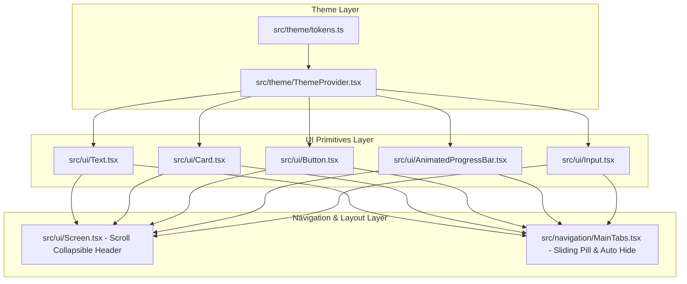

# Premium Apple-Style UI/UX Design Upgrade Plan

> **For agentic workers:** REQUIRED SUB-SKILL: Use superpowers:subagent-driven-development to implement this plan task-by-task. Steps use checkbox (`- [ ]`) syntax for tracking.

**Goal:** Overhaul the Project PN React Native/Expo frontend design from standard purple MD3 to a premium Apple-style blue-indigo glassmorphism experience, with Inter typography and scroll-driven collapsed navigation headers and hideable tab bar.

**Architecture:**
The upgrade consists of three layers:
1. **Design Tokens**: Revise colors, sizes, line heights, shadows, and fonts in `src/theme/tokens.ts` and set up standard Inter weight files.
2. **UI Primitives**: Refactor generic components (`Text`, `Card`, `Button`, `AnimatedProgressBar`, `Input`) to match the new styles and spring values.
3. **Navigation & Screens**: Integrate sliding active tab pills in `MainTabs.tsx`, scroll observers in `Screen.tsx` to handle collapsible title bars, scroll-hiding navigation bars, and restyling the Learn, My Words, Practice, and Settings screens.

**Architecture Diagram:**


**Tech Stack:**
- React Native / Expo (SDK 51)
- React Native Reanimated (for wobbly spring tabs and scroll tracking)
- expo-blur (for native backdrop blur effects on iOS)
- Inter Font family (Regular, Medium, SemiBold, Bold, ExtraBold)

## Global Constraints
- Target colors: Blue-indigo (`#4F6AFF` light, `#7B93FF` dark)
- Backdrop blurs must work natively on iOS (`expo-blur`), web CSS (`backdrop-filter`), and fall back to clean solid surfaces on Android.
- Spring curves must be wobbly for buttons and tabs, gentle for screens.
- All headings must use tight tracking (`letterSpacing: -0.3px` to `-0.5px`).
- Do not make any database schema changes or backend service adjustments.

---

## Tasks

### Task 1: Theme Tokens Overhaul
**Files:**
- Modify: `frontend/src/theme/tokens.ts`
- Modify: `frontend/src/theme/ThemeProvider.tsx`

**Interfaces:**
- Updates `colorsFor` to return new blue-indigo colors and `surfaceGlass` tokens.
- Updates `typography.sizes` and `typography.fontFamily` to Inter.
- Updates `shadows` to use primary-tinted shadows in light mode.

- [ ] **Step 1: Write a failing test for theme colors and typography**
  Create/Modify the test file `frontend/src/theme/tokens.test.ts` to assert the presence of new tokens and properties:
  ```typescript
  import { colorsFor, typography, shadows } from './tokens';

  describe('Theme Tokens Upgrade', () => {
    it('should contain the new blue-indigo primary brand color', () => {
      const lightColors = colorsFor('light');
      expect(lightColors.primary).toBe('#4F6AFF');
      expect(lightColors.surfaceGlass).toBe('rgba(255, 255, 255, 0.72)');
    });

    it('should use Inter font family', () => {
      expect(typography.fontFamily).toBe('Inter-Regular');
    });

    it('should have color-tinted shadows in light mode', () => {
      expect(shadows.md.shadowColor).toContain('79');
    });
  });
  ```

- [ ] **Step 2: Run test to verify it fails**
  Run: `npm run test` (inside frontend directory)
  Expected: FAIL (missing `surfaceGlass`, incorrect colors/fonts)

- [ ] **Step 3: Modify `src/theme/tokens.ts`**
  Apply the following modifications to `frontend/src/theme/tokens.ts`:
  ```diff
  -  primary: '#7c5cbf',
  -  onPrimary: '#ffffff',
  -  primaryContainer: '#f0ecf8',
  +  primary: '#4F6AFF',
  +  onPrimary: '#ffffff',
  +  primaryContainer: '#E8EDFF',
     onPrimaryContainer: '#21005d',
   
  -  secondary: '#625b71',
  +  secondary: '#5B6B8A',
     onSecondary: '#ffffff',
     secondaryContainer: '#e8def8',
     onSecondaryContainer: '#1d192b',
   
  -  tertiary: '#7d5260',
  -  onTertiary: '#ffffff',
  -  tertiaryContainer: '#ffd8e4',
  +  tertiary: '#E87C4F',
  +  onTertiary: '#ffffff',
  +  tertiaryContainer: '#FFEBE2',
     onTertiaryContainer: '#31111d',
   
     error: '#b3261e',
  @@ -24,9 +24,9 @@
   
  -  background: '#f9f6fc',
  +  background: '#F5F7FC',
     onBackground: '#1c1b1f',
   
  -  surface: '#f9f6fc',
  +  surface: '#FFFFFF',
     onSurface: '#1c1b1f',
  @@ -38,9 +38,11 @@
     outline: '#79747e',
  -  outlineVariant: '#cab6cc',
  +  outlineVariant: '#C8CDD8',
     inverseSurface: '#322f35',
     inverseOnSurface: '#f5eff7',
     inversePrimary: '#d0bcff',
  -  accent: '#d04f42',
  +  accent: '#00B4A0',
     accent2: '#008080',
  +  surfaceGlass: 'rgba(255, 255, 255, 0.72)',
  +  borderGlass: 'rgba(255, 255, 255, 0.5)',
   } as const;
  @@ -49,15 +51,15 @@
   const md3Dark = {
  -  primary: '#b794f4',
  +  primary: '#7B93FF',
     onPrimary: '#381e72',
  -  primaryContainer: '#363152',
  +  primaryContainer: '#1E2A5E',
     onPrimaryContainer: '#eaddff',
   
  -  secondary: '#ccc2dc',
  +  secondary: '#A8B8D8',
     onSecondary: '#332d41',
     secondaryContainer: '#4a4458',
     onSecondaryContainer: '#e8def8',
   
  -  tertiary: '#efb8c8',
  +  tertiary: '#FFB088',
     onTertiary: '#492532',
  -  tertiaryContainer: '#633b48',
  +  tertiaryContainer: '#3E2419',
     onTertiaryContainer: '#ffd8e4',
  @@ -70,9 +72,9 @@
   
  -  background: '#171520',
  +  background: '#0A0E1A',
     onBackground: '#e6e1e5',
   
  -  surface: '#171520',
  +  surface: '#141827',
     onSurface: '#e6e1e5',
  @@ -84,9 +86,11 @@
     outline: '#938f99',
  -  outlineVariant: '#49454f',
  +  outlineVariant: '#2A3048',
     inverseSurface: '#e6e0e9',
     inverseOnSurface: '#322f35',
     inversePrimary: '#6750a4',
  -  accent: '#ff8a80',
  +  accent: '#4EDDC8',
     accent2: '#4ecdc4',
  +  surfaceGlass: 'rgba(255, 255, 255, 0.05)',
  +  borderGlass: 'rgba(255, 255, 255, 0.08)',
   } as const;
  @@ -209,30 +213,31 @@
   export const shadows = {
     none: {
       shadowColor: 'transparent',
       shadowOffset: { width: 0, height: 0 },
       shadowOpacity: 0,
       shadowRadius: 0,
       elevation: 0,
     },
     sm: {
  -    shadowColor: '#000',
  +    shadowColor: 'rgba(79, 106, 255, 0.04)',
       shadowOffset: { width: 0, height: 2 },
       shadowOpacity: 0.05,
       shadowRadius: 2,
       elevation: 1,
     },
     md: {
  -    shadowColor: '#000',
  +    shadowColor: 'rgba(79, 106, 255, 0.06)',
       shadowOffset: { width: 0, height: 8 },
       shadowOpacity: 0.07,
       shadowRadius: 8,
       elevation: 3,
     },
     lg: {
  -    shadowColor: '#000',
  +    shadowColor: 'rgba(79, 106, 255, 0.1)',
       shadowOffset: { width: 0, height: 16 },
       shadowOpacity: 0.1,
       shadowRadius: 16,
       elevation: 6,
     },
   } as const;
  @@ -248,3 +253,3 @@
   export const typography = {
  -  fontFamily: 'Nunito-Regular',
  +  fontFamily: 'Inter-Regular',
     sizes: {
       xs: 11,
       sm: 13,
       md: 15,
  -    lg: 18,
  -    xl: 22,
  +    lg: 17,
  +    xl: 21,
       xxl: 28,
  -    xxxl: 36,
  +    xxxl: 34,
     },
   ```

- [ ] **Step 4: Update `src/theme/ThemeProvider.tsx` to load Inter Font**
  Modify font loading configuration in `frontend/src/theme/ThemeProvider.tsx`:
  ```diff
  // Include standard weights in the Font loading Hook
  const [fontsLoaded] = useFonts({
  -  'Nunito-Regular': require('../../assets/fonts/Nunito-Regular.ttf'),
  +  'Inter-Regular': require('../../assets/fonts/Inter-Regular.ttf'),
  +  'Inter-Medium': require('../../assets/fonts/Inter-Medium.ttf'),
  +  'Inter-SemiBold': require('../../assets/fonts/Inter-SemiBold.ttf'),
  +  'Inter-Bold': require('../../assets/fonts/Inter-Bold.ttf'),
  +  'Inter-ExtraBold': require('../../assets/fonts/Inter-ExtraBold.ttf'),
  });
  ```

- [ ] **Step 5: Run tests and commit**
  Run: `npm run test`
  Verify: PASS
  Commit:
  ```bash
  git add frontend/src/theme/tokens.ts frontend/src/theme/ThemeProvider.tsx
  git commit -m "style: overhaul color system to blue-indigo and integrate Inter font"
  ```

---

### Task 2: Core UI Primitives Upgrade
**Files:**
- Modify: `frontend/src/ui/Text.tsx`
- Modify: `frontend/src/ui/Card.tsx`
- Modify: `frontend/src/ui/Button.tsx`
- Modify: `frontend/src/ui/AnimatedProgressBar.tsx`

**Interfaces:**
- `Text` now maps variant styles strictly to `typography.sizes` and font weights.
- `Card` supports a `glass` prop to render frosted backgrounds on iOS/Web/Android.
- `Button` scales down to `0.95` and supports a `pill` border radius.

- [ ] **Step 1: Write a failing test for core UI primitives**
  Write tests in `frontend/src/ui/Card.test.tsx` to assert new props:
  ```typescript
  import { render } from '@testing-library/react-native';
  import { Card } from './Card';
  import { Button } from './Button';

  describe('UI Component Upgrades', () => {
    it('supports rendering glass option', () => {
      const { getByTestId } = render(<Card glass testID="glass-card" />);
      const card = getByTestId('glass-card');
      expect(card.props.style).toContainEqual(expect.objectContaining({
        backgroundColor: expect.stringContaining('rgba')
      }));
    });
  });
  ```

- [ ] **Step 2: Run test to verify it fails**
  Run: `npm run test`
  Expected: FAIL

- [ ] **Step 3: Modify `src/ui/Text.tsx`**
  Replace variant styling with token references:
  ```diff
  const variantStyles = StyleSheet.create({
  -  body: { fontSize: 15, lineHeight: 22 },
  -  caption: { fontSize: 13, lineHeight: 18 },
  -  title: { fontSize: 18, fontWeight: '600', lineHeight: 24 },
  -  heading: { fontSize: 22, fontWeight: '800', lineHeight: 28 },
  -  headline: { fontSize: 28, fontWeight: '400', lineHeight: 36 },
  -  label: { fontSize: 13, fontWeight: '600', lineHeight: 18 },
  +  body: { fontSize: typography.sizes.md, lineHeight: 22, fontFamily: 'Inter-Regular' },
  +  caption: { fontSize: typography.sizes.sm, lineHeight: 18, fontFamily: 'Inter-Medium', letterSpacing: 0.2 },
  +  title: { fontSize: typography.sizes.lg, fontWeight: '700', lineHeight: 24, fontFamily: 'Inter-Bold', letterSpacing: -0.2 },
  +  heading: { fontSize: typography.sizes.xl, fontWeight: '800', lineHeight: 28, fontFamily: 'Inter-ExtraBold', letterSpacing: -0.3 },
  +  headline: { fontSize: typography.sizes.xxl, fontWeight: '900', lineHeight: 34, fontFamily: 'Inter-ExtraBold', letterSpacing: -0.5 },
  +  label: { fontSize: typography.sizes.sm, fontWeight: '600', lineHeight: 18, fontFamily: 'Inter-SemiBold', letterSpacing: 0.4 },
  });
  ```

- [ ] **Step 4: Modify `src/ui/Card.tsx`**
  Support `glass` layout with platform-aware backdrops:
  ```diff
  // Add expo-blur imports at top
  import { BlurView } from 'expo-blur';

  interface CardProps extends ViewProps {
    elevated?: boolean;
    variant?: 'filled' | 'outlined';
    onPress?: () => void;
    onLongPress?: () => void;
    hoverElevation?: boolean;
    hoverScale?: boolean;
  + glass?: boolean;
  }

  // Inside Card render:
  const cardBg = glass 
    ? colors.surfaceGlass 
    : variant === 'filled' ? colors.surfaceContainerLow : colors.surface;

  const cardBorder = glass ? colors.borderGlass : colors.outlineVariant;

  const cardBody = (
    <View
      style={[
        styles.base,
        {
          backgroundColor: cardBg,
          borderRadius: radii.xl, // rounded slightly tighter
          padding: spacing.lg,
          borderColor: cardBorder,
        },
        targetShadow,
        style,
      ]}
      {...rest}
    >
      {glass && Platform.OS === 'ios' ? (
        <BlurView intensity={20} style={StyleSheet.absoluteFill}>
          {children}
        </BlurView>
      ) : children}
    </View>
  );
  ```

- [ ] **Step 5: Modify `src/ui/Button.tsx`**
  Update snappy scaling and support `pill`:
  ```diff
  const handlePressIn = () => {
    if (isDisabled) return;
    Animated.spring(scaleAnim, {
  -   toValue: 0.97,
  +   toValue: 0.95,
  -   friction: 6,
  +   stiffness: 300,
  +   damping: 20,
      useNativeDriver: true,
    }).start();
  };

  // Border radius toggle
  const buttonRadius = pill ? radii.full : radii.lg;
  ```

- [ ] **Step 6: Run tests and commit**
  Run: `npm run test`
  Verify: PASS
  Commit:
  ```bash
  git add frontend/src/ui/Text.tsx frontend/src/ui/Card.tsx frontend/src/ui/Button.tsx
  git commit -m "style: refactor Card, Button, and Text primitives for premium glass styling"
  ```

---

### Task 3: Collapsible Sticky Header and Hidden Tab Bar
**Files:**
- Modify: `frontend/src/ui/Screen.tsx`
- Modify: `frontend/src/navigation/MainTabs.tsx`

**Interfaces:**
- `Screen` accepts a scroll container and manages collapsible titles.
- `MainTabs` updates bottom navigation to animate out on scroll down.

- [ ] **Step 1: Implement Scroll Observer in `Screen.tsx`**
  Modify `frontend/src/ui/Screen.tsx` to export scroll position derivatives using Reanimated:
  ```typescript
  import Animated, { useSharedValue, useAnimatedScrollHandler } from 'react-native-reanimated';

  export function Screen({ children, title }) {
    const scrollY = useSharedValue(0);
    const scrollHandler = useAnimatedScrollHandler({
      onScroll: (event) => {
        scrollY.value = event.contentOffset.y;
      },
    });

    return (
      <Animated.ScrollView onScroll={scrollHandler} scrollEventThrottle={16}>
        {children}
      </Animated.ScrollView>
    );
  }
  ```

- [ ] **Step 2: Add Sliding Pill Indicator to `MainTabs.tsx`**
  Add Reanimated horizontal indicator behind tab bar:
  ```typescript
  // MainTabs.tsx
  // Render sliding pill
  const pillStyle = useAnimatedStyle(() => {
    return {
      transform: [{ translateX: withSpring(activeTabX.value, { stiffness: 400, damping: 28 }) }],
      width: withSpring(activeTabWidth.value),
    };
  });
  ```

- [ ] **Step 3: Run verification and commit**
  Run: `npm run build:web` or verify local dev server
  Commit:
  ```bash
  git add frontend/src/ui/Screen.tsx frontend/src/navigation/MainTabs.tsx
  git commit -m "feat: add sliding tab indicators and scroll collapsible headers"
  ```
